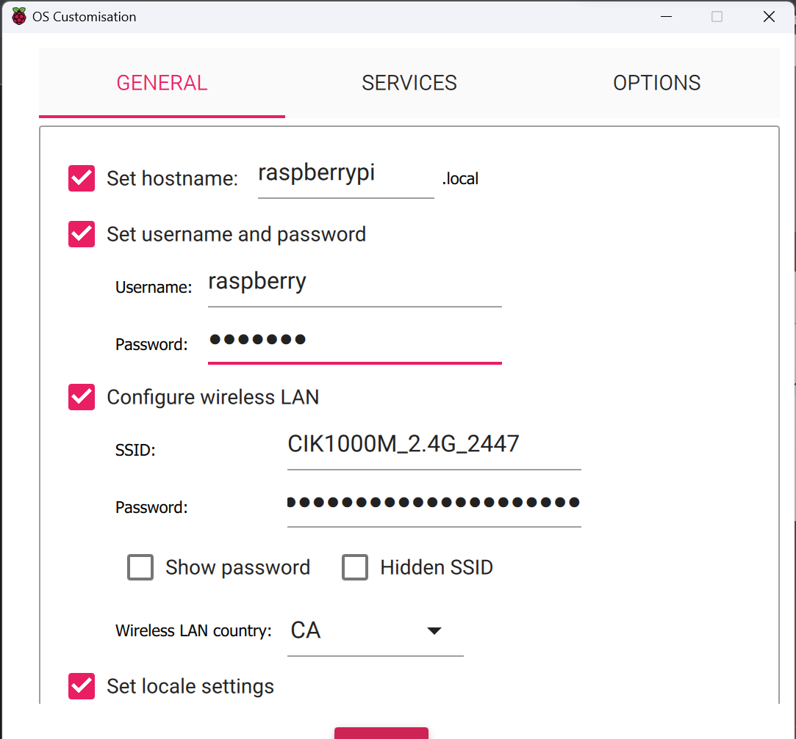
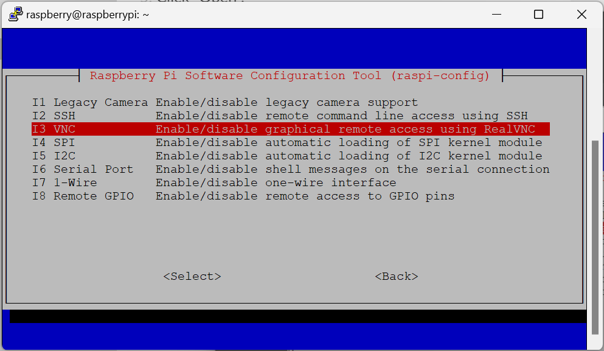

# Pacman

## About the Project 

This project is a clone of the Pac-Man game to be run on a Raspberry Pi to create a mini arcade machine. Current instructions are for simply running the game program on a Raspberry Pi (hardware not yet connected).

### Built With


## Getting Started

### Prerequisites

#### Hardware

+ Raspberry Pi (I use a Raspberry Pi Zero W)
+ MicroSD card (at least 16 GB of storage)
+ MicroUSB power supply
+ MicroUSB to USB-B cable

#### Software

+ [Raspberry Pi Imager](https://www.raspberrypi.com/software/)
+ [PuTTy](https://www.putty.org/)
+ [RealVNC Viewer](https://www.realvnc.com/en/connect/download/viewer/)
+ [Bonjour Print Services](https://support.apple.com/kb/DL999?locale=en_CA)

### Installation

#### Set up the MicroSD card

1. Insert your MicroSD card in your computer.
2. Launch the Raspberry Pi Imager.
3. Select your Raspberry Pi from the list in the "Raspberry Pi Device" field.
4. Select "Raspberry Pi OS" from the list in the "Operating System" field.
5. Select your MicroSD card in the "Storage" field.

6. Click "Next", then click "Edit Settings".
7. Set your hostname to raspberrypi.local and set a username and password.

8. In the "Services" tab, select "Enable SSH" and "Use password authentication".

9. Click "Save" and then click "Yes" to apply your customization settings and initialize the flashing process.
10. Close the Raspberry Pi Imager once the process is complete.
11. Navigate to the main directory of your microSD card (should be named **bootfs** or similar).
12. Open the ``config.txt`` file. At the end of the file, append:
```
dtoverlay=dwc2
```
13. Save and close the file.
14. Open the ``cmdline.txt`` file. After the command ``rootwait``, insert the following command:
```
modules-load=dwc2,g_ether
```
15. Save and close the file.
16. Eject and remove the MicroSD card from your computer and insert it into the MicroSD slot on your Raspberry Pi.

#### Connect Raspberry Pi to computer

1. Connect the Raspberry Pi to power.
2. Connect the Raspberry Pi to your computer using the microUSB to USB-B cable.
3. Open the PuTTY application.
4. In the Host Name field, type "raspberrypi.local".

5. Click "Open".
6. Enter your username and password in the SSH session as prompted.
7. Enter the command:
```
sudo raspi-config
```
8. In the Raspberry Pi configuration menu, navigate to "Interface Options" and press Enter to select.

9. In the menu, navigate to "VNC" and press Enter to select.

10. Press Enter again to enable the VNC server.
11. Launch the RealVNC Viewer.
12. In the VNC server address field, enter "raspberrypi.local".

13. Enter your username and password in the pop up window. Your computer should now be connected to your Raspberry Pi.

#### Run the project

1. Open the terminal and install pandas with the following command:
```
sudo apt-get install python3-pandas
```
2. Clone this repository.
3. Run the project in the repository root directory with the following command:
```
python main.py
```  

## Roadmap

- [x] Create Pac-Man game in Python
- [x] Run Pac-Man game on Raspberry Pi
- [ ] Connect arcade components to Raspberry Pi
- [ ] 3D print arcade machine casing to house components

## License

Distributed under the MIT License. See `LICENSE.txt` for more information.